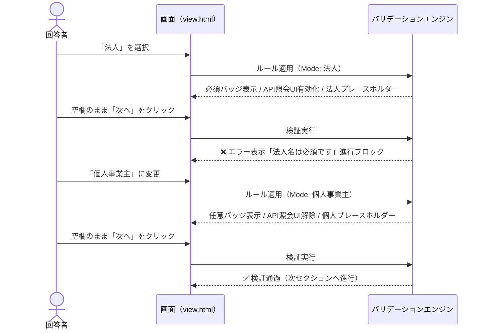

# 🏢 法人名・屋号の分岐入力制御とDB列統一 仕様書＆インタラクティブ資料

> [!NOTE]
> 本資料は、**「法人の会社名は必須、個人の屋号は任意」**という入力制御を担保しながら、**データベースやGoogleスプレッドシート上で「同じ1つの列」に集約して保存する**ための2大アプローチの具現化仕様書です。
> 実際にブラウザで操作して試せる **[対話型シミュレーター（interactive_demo.html）](file:///C:/Users/kyosh/.gemini/antigravity/brain/90be9b77-a315-452a-91b1-e642cf0c53e1/interactive_demo.html)** を同梱しています。

---

## 1. 課題の本質とジレンマの構造

```mermaid
graph TD
    subgraph 回答者の入力体験（UI層）
        Type{事業形態の選択}
        Type -->|法人| CorpSec["🏢 法人向け画面<br>・法人名（必須・API検索）<br>・代表取締役氏名（必須）"]
        Type -->|個人事業主| IndivSec["👤 個人向け画面<br>・屋号（任意・空欄可）<br>・事業主氏名（必須）"]
    end

    subgraph 従来のDB保存（質問＝カラム名）
        CorpSec -->|別々の質問| ColA["列A: 法人名"]
        CorpSec -->|別々の質問| ColC["列C: 代表取締役氏名"]
        IndivSec -->|別々の質問| ColB["列B: 屋号 (空欄だらけ)"]
        IndivSec -->|別々の質問| ColD["列D: 事業主氏名"]
    end

    subgraph 理想のDB保存（統合カラム）
        CorpSec -.->|統合| UnifiedCol1[("列1: 法人名・屋号<br>（1本化）")]
        IndivSec -.->|統合| UnifiedCol1
        CorpSec -.->|統合| UnifiedCol2[("列2: 代表者名<br>（1本化）")]
        IndivSec -.->|統合| UnifiedCol2
    end
```

* **入力側の要件**: 法人には厳格な必須入力と法人番号APIを適用し、個人には屋号なしでも先へ進める柔軟性を持たせたい。
* **データ側の要件**: 後続の請求書発行、CRM、メール配信、集計のため、列は「法人名・屋号」「代表者名」として1列に整然と並べたい。

---

## 2. アプローチ②：出力カラム名（データ連携キー / `dataKey`）仕様

### 2.1 コンセプト
画面上は**セクション分岐**で法人と個人の質問を完全に分け、それぞれの質問設定に**「出力カラム名（データキー）」**を指定します。同一のキーを持つ質問同士は、送信時に自動的に同じDBカラムにマージされます。

### 2.2 データ構造（Schema）

```json
{
  "sections": [
    {
      "id": "sec_corp",
      "title": "法人情報入力",
      "questions": [
        {
          "id": "q_corp_name",
          "type": "text",
          "title": "法人名（会社名）",
          "dataKey": "company_or_trade_name",
          "required": true,
          "validation": { "category": "api", "condition": "corp_name" }
        },
        {
          "id": "q_corp_rep",
          "type": "text",
          "title": "代表取締役氏名",
          "dataKey": "representative_name",
          "required": true
        }
      ]
    },
    {
      "id": "sec_indiv",
      "title": "個人事業主情報入力",
      "questions": [
        {
          "id": "q_trade_name",
          "type": "text",
          "title": "屋号",
          "dataKey": "company_or_trade_name",
          "required": false,
          "description": "屋号がない場合は空欄のままで構いません。"
        },
        {
          "id": "q_indiv_rep",
          "type": "text",
          "title": "事業主氏名",
          "dataKey": "representative_name",
          "required": true
        }
      ]
    }
  ]
}
```

### 2.3 エディタ画面UI（モックアップ）

質問カードの詳細設定エリアに、以下の設定項目が追加されます：

```
┌─────────────────────────────────────────────────────────────┐
│ 質問 2: 屋号                                        記述式(短文) │
├─────────────────────────────────────────────────────────────┤
│ 質問タイトル: [ 屋号                                      ] │
│ 説明（任意）: [ 屋号がない場合は空欄のままで構いません。      ] │
│ [ ] 必須回答                                                │
├ ─ ─ ─ ─ ─ ─ ─ ─ ─ ─ ─ ─ ─ ─ ─ ─ ─ ─ ─ ─ ─ ─ ─ ─ ─ ─ ─ ─ ─ ─ ─ ┤
│ 🏷️ 出力カラム名（データ連携キー）                              │
│ [ company_or_trade_name                                   ] │
│ ℹ️ データベースやスプレッドシート上で保存する列名（エイリアス）を指定。  │
│    他の質問（例: 法人名）と同じキーを指定すると、同一列に統合されます。 │
└─────────────────────────────────────────────────────────────┘
```

### 2.4 送信時マージ処理ロジック（`view.html`）

```javascript
// フォーム送信時のデータ生成
const submitData = {};

formDefinition.sections.forEach(s => {
  (s.questions || []).forEach(q => {
    const val = formValues[q.id];
    if (val !== undefined && val !== '') {
      // dataKey があれば最優先で使用、未設定なら title、それもなければ id
      const targetColumnKey = (q.dataKey && q.dataKey.trim()) 
        ? q.dataKey.trim() 
        : (q.title || q.id);

      submitData[targetColumnKey] = val;
    }
  });
});
```

> [!TIP]
> **未入力時のフォールバック**:
> 個人事業主が屋号を空欄で送信した場合、`company_or_trade_name` には自動的に `（屋号なし）` や空文字がセットされ、列が欠落することなくテーブルの整合性が維持されます。

---

## 3. アプローチ③：条件付き動的バリデーション（Conditional Validation）仕様

### 3.1 コンセプト
質問項目は**「法人名・屋号」という1つの質問のまま**設置します。
直前の質問（「事業形態: 法人 / 個人事業主」）の選択状態を監視し、JavaScriptがリアルタイムに必須フラグやバリデーション規則、UI表示を書き換えます。

### 3.2 データ構造（Schema）

```json
{
  "id": "q_org_name",
  "type": "text",
  "title": "法人名・屋号",
  "required": false,
  "conditionalRules": {
    "targetQuestionId": "q_biz_type",
    "cases": [
      {
        "equals": "法人",
        "setRequired": true,
        "setValidation": { "category": "api", "condition": "corp_name" },
        "setTitleBadge": "必須",
        "setDescription": "正式な法人名を入力してください。（法人番号API連携）",
        "setPlaceholder": "例: 株式会社wayway"
      },
      {
        "equals": "個人事業主",
        "setRequired": false,
        "setValidation": null,
        "setTitleBadge": "任意",
        "setDescription": "屋号をお持ちの場合はご入力ください。（ない場合は未入力可）",
        "setPlaceholder": "例: ヤマダデザイン事務所（ない場合は空欄）"
      }
    ]
  }
}
```

### 3.3 動作フロー



---

## 4. 2大仕様の比較・決定マトリクス

| 評価軸 | アプローチ②：出力カラム名（データキー） | アプローチ③：条件付き動的バリデーション |
| :--- | :--- | :--- |
| **画面構成** | **セクション分岐**（法人用 / 個人用） | **同一画面**（1つの入力枠） |
| **回答者体験 (UX)** | **★★★★★（最高）**<br>自社に関係ない項目や説明が一切目に入らず、迷わない | **★★★★☆（良好）**<br>切り替えはスムーズだが、1つの枠で法人・個人の両方を意識させる |
| **法人番号APIの相性** | **★★★★★（完全分離）**<br>法人画面にだけAPIを置けるため誤作動ゼロ | **★★★☆☆（制御が必要）**<br>個人選択時に検索サジェストをスクリプトで停止・非表示にする制御が必要 |
| **他項目への汎用性** | **★★★★★（極めて高い）**<br>「代表取締役氏名」と「事業主氏名」も `rep_name` で即座に統合可能 | **★★★☆☆（限定的）**<br>項目ごとに個別で動的ルールを設定する必要がある |
| **エディタ設定の容易さ** | **★★★★★（簡単）**<br>質問設定欄に「保存列名」を入れるだけ | **★★★☆☆（やや複雑）**<br>条件分岐ルールを組むエディタUIが必要 |
| **DB列の統合性** | **100% 1列に統合** | **100% 1列に統合** |

---

## 5. アーキテクト推奨と実装ロードマップ

### 結論
総合的な保守性・回答者のUX・API連携の安定性から、**「アプローチ②：出力カラム名（データキー）機能」の採用を強く推奨**します。

### 実装手順（アプローチ②を採用する場合）
1. **エディタ改修 (`custom-editor-v107.js`)**:
   - 質問カードの詳細設定エリアに `🏷️ 出力カラム名（データキー）` 入力欄を追加。
   - 質問モデルに `q.dataKey` プロパティを保持・同期する。
2. **回答画面改修 (`view.html`)**:
   - `submitForm()` 内の送信データ生成部で `q.dataKey || q.title || q.id` をキーとして採用。
3. **既存フォームとの互換性**:
   - `dataKey` が空欄の場合は自動的に従来の `q.title || q.id` が使われるため、過去のフォーム資産を一切壊さず100%互換性が保たれます。

---

## 6. 実機対話シミュレーターの起動方法

ブラウザで以下のファイルを開くことで、両方の動作をその場で操作・比較していただけます：
* **シミュレーターファイル**: [`interactive_demo.html`](file:///C:/Users/kyosh/.gemini/antigravity/brain/90be9b77-a315-452a-91b1-e642cf0c53e1/interactive_demo.html)
