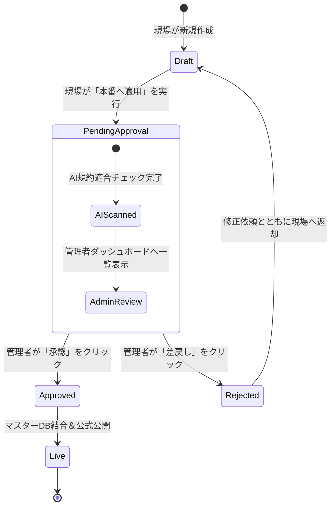

# 🏛️ Synapse 組織統制型AIフォームビルダー＆新機能詳細設計書
**バージョン:** 1.0  
**対象システム:** Synapse Form Customize (`form-customize/`) & Synapse Core (`app.js`)  
**作成日:** 2026年9月11日  

---

## 1. エグゼクティブサマリー＆背景

### 1.1 背景と課題
従来のWebフォームビルダーでは、以下の3つの相反する要求が衝突し、システム運用上の大きな課題となっていました：
1. **現場（作成者）の入力・設定負担**:
   - 入力規則（正規表現）、API連携、メール控え、同意スクロールなど、1つの質問に対する設定項目が多すぎ、認知負荷が高い。
2. **データベース（管理者）のデータ分散・スパース化**:
   - 「法人（会社名・本店所在地・法人番号）」と「個人（屋号・郵便番号・事業主氏名）」で入力画面や連携APIが異なるため、質問を分けるとDB/スプレッドシートの列が分裂し、後続の請求・CRM・集計が複雑化する。
3. **データガバナンスとリテラシーの壁**:
   - 一般のユーザーやプロ版ユーザーに、DBスキーマの正規化やカラムマッピングを自力で理解・設定させるのは不可能。
   - 一般的な生成AIでは「一般的なフォーム論」しか返せず、社内固有のDB設計や命名規則を担保できない。

### 1.2 解決方針（コアアーキテクチャ）
* **① 2層UI（質問作成と詳細設定の完全分離）**:
  質問カードはタイトル・形式・選択肢・必須のみの超軽量構成とし、高度な設定はスライド式「詳細設定ドロワー」に隔離。
* **② 出力カラム名（データキー / `dataKey`）によるDB列統合**:
  画面上で分かれた質問（法人名と屋号、法人住所と個人住所など）に同一キーを割り当て、DB上で1本化。
* **③ 教育済みAIコンシェルジュ（仮想データアーキテクト）**:
  管理者が定義した「シナプスDB統制マスター規約」をAIに事前教育。現場が質問を並べるだけで、AIが自動でデータキー・API連携・入力規則を補正。
* **④ 本番適用後の管理者承認ワークフロー（Governance Gate）**:
  現場がフォームを本番適用（公開申請）した後、AIの「規約適合レポート（適合率100%）」をもとに管理者がワンクリックでマスターDBへ正式結合を承認。

---

## 2. 全体システムアーキテクチャ＆ライフサイクル

```mermaid
flowchart TD
    subgraph 現場（作成フェーズ）
        A[質問・選択肢の作成<br>※超シンプル・迷わない] --> B[教育済みAIの自動スキャン<br>※管理者規約に基づき自動補正]
        B --> C[データキー自動割当 / API自動接続<br>・法人名＆屋号 ➔ company_name<br>・法人＆個人住所 ➔ address]
        C --> D[現場が『本番へ適用』をクリック]
    end

    subgraph 統制ゲート（承認フェーズ）
        D --> E{ステータス: 承認待ち<br>Pending Admin Approval}
        E --> F[管理者ダッシュボード]
        F --> G[AI規約適合レポート確認<br>『規約適合率: 100%』]
        G -->|承認 Approve| H[正式本番公開<br>マスターDB自動結合]
        G -->|差戻 Reject| I[修正依頼通知<br>下書きへ戻す]
    end

    subgraph 回答・データ蓄積フェーズ
        H --> J[回答者による入力・送信]
        J --> K[送信時マージ処理<br>dataKey単位で統合]
        K --> L[(Synapse マスターテーブル<br>state.customTables / DB)]
    end
```

---

## 3. フォームのバリエーション（新設プリセット＆テンプレート群）

組織のデータ構造に即座に適合するよう、以下の標準バリエーションをシステムに標準搭載します。

### 3.1 バリエーション①：法人・個人自動分岐ハイブリッド（B2B / B2C 統合型）
* **用途**: 取引先登録、会員登録、業務委託・発注申請、イベント申込
* **構造**:
  * **セクション1（共通）**: 「事業形態の選択（法人 / 個人事業主）」➔ 次のアクションでセクション分岐
  * **セクション2（法人用）**:
    * 法人名（国税庁API連携） ➔ **本店所在地・郵便番号まで全自動補完**
    * 代表取締役氏名
    * 法人番号 / インボイス番号
  * **セクション3（個人事業主用）**:
    * 屋号（任意入力）
    * 郵便番号（ZipCloud API連携） ➔ **住所自動補完**
    * 事業主氏名
* **DB列の統合**:
  両セクションの項目はすべて同一の共通データキーにマージされ、DB上は1列に集約。

### 3.2 バリエーション②：本人確認・セキュア認証型
* **用途**: パスワード登録、重要書類提出、マイページ開設
* **構造**:
  * メールアドレス（回答控え自動送信型）
  * 携帯電話番号（SMS認証・ハイフン両対応）
  * パスワード入力（伏せ字・確認用入力・目のマーク同期）
  * 規約同意（スクロール最下部到達必須ロック）

### 3.3 バリエーション③：金融機関・口座登録型
* **用途**: 報酬振込先登録、口座振替依頼、返金先指定
* **構造**:
  * 銀行名（全銀協コードAPI連携）
  * 支店名・支店番号（全銀協支店API連携）
  * 口座種別（普通・当座・貯蓄）
  * 口座番号（7桁半角数字チェック）
  * 口座名義（カナ・カッコ記号厳格チェック）

---

## 4. 機能詳細設計

### 4.1 出力カラム名（データキー / `dataKey`）機能

#### 4.1.1 データモデル（Schema拡張）
各質問（`Question`）オブジェクトに `dataKey` を追加：

```typescript
interface Question {
  id: string;                      // 質問固有ID (例: "q_corp_name_123")
  type: string;                    // "text" | "paragraph" | "radio" | "select" 等
  title: string;                   // 画面表示タイトル (例: "法人名（会社名）")
  description?: string;            // 説明文
  required: boolean;               // 必須フラグ
  dataKey?: string;                // ★新設: DB保存先カラム名 (例: "company_or_trade_name")
  groupId?: string;                // グループID
  validation?: ValidationRule;     // 入力規則
  autoReply?: boolean;             // 回答控えメール送信対象
  options?: QuestionOption[];      // 選択肢
}
```

#### 4.1.2 送信時マージ処理ロジック（`view.html` / `submitForm`）
```javascript
function extractSubmitData(formDefinition, formValues) {
  const submitData = {};

  formDefinition.sections.forEach(sec => {
    (sec.questions || []).forEach(q => {
      const val = formValues[q.id];
      if (val !== undefined && val !== null && val !== '') {
        // dataKey があれば最優先、なければ title、それもなければ id をカラム名に採用
        const columnKey = (q.dataKey && q.dataKey.trim()) 
          ? q.dataKey.trim() 
          : (q.title || q.id);

        submitData[columnKey] = val;
      }
    });
  });

  return submitData;
}
```

---

### 4.2 UIの2層分離設計（質問カードの軽量化 ＆ 詳細ドロワー）

#### 4.2.1 質問カード（第1層：超シンプル構成）
```
┌─────────────────────────────────────────────────────────────┐
│ ≡  質問 1: 法人名（会社名）                          記述式(短文) ▼│
├─────────────────────────────────────────────────────────────┤
│ タイトル: [ 法人名（会社名）                                ] │
│ 説明:     [ 正式な法人名を入力してください。                ] │
│                                                             │
│ [✓] 必須回答                [ 🏷️ 列: 法人名・屋号 ] [⚙️ 詳細設定] │
└─────────────────────────────────────────────────────────────┘
```

#### 4.2.2 スライド式「詳細設定ドロワー」（第2層：高度設定の集中管理）
カード右端の **`[⚙️ 詳細設定]`** をクリックすると、画面右からスムーズに設定パネルがスライドイン表示されます：

```
┌───────────────────────────────────────┐
│ ⚙️ 質問詳細設定: 法人名（会社名）  [✕] │
├───────────────────────────────────────┤
│ 🏷️ データベース保存先（列名）         │
│ [ 法人名・屋号                      ] │
│ 💡 他の質問（例: 屋号）と同じ名前を指定│
│    すると、DB上で同じ列に統合されます。│
├───────────────────────────────────────┤
│ 🛡️ 入力規則（検証・バリデーション）   │
│ 種類: [ API連携 ▼ ]                   │
│ ルール: [ 法人名検索（国税庁API） ▼ ] │
│ エラー表示: [ 実在する法人名を選択... ]│
├───────────────────────────────────────┤
│ 📨 メール設定                         │
│ [ ] この項目に回答内容の控えを自動送信 │
├───────────────────────────────────────┤
│ 📎 メディア添付                       │
│ [ ] 説明用の画像・動画ファイルを添付  │
└───────────────────────────────────────┘
```

---

### 4.3 教育済みAIコンシェルジュ（統制AI）エンジン

#### 4.3.1 管理者ルール辞書（Synapse Governance Master）
AIが常時参照するマスターナレッジをJSON形式で保持：

```json
{
  "governanceRules": [
    {
      "ruleId": "RULE_CORP_TRADE_MERGE",
      "targetPatterns": ["法人名", "会社名", "屋号", "商号"],
      "unifiedDataKey": "company_or_trade_name",
      "unifiedLabel": "法人名・屋号",
      "apiAssignment": {
        "corpMatch": "api:corp_search",
        "indivMatch": null
      }
    },
    {
      "ruleId": "RULE_REPRESENTATIVE_MERGE",
      "targetPatterns": ["代表取締役", "代表者名", "事業主氏名", "代表者氏名"],
      "unifiedDataKey": "representative_name",
      "unifiedLabel": "代表者名"
    },
    {
      "ruleId": "RULE_ADDRESS_STANDARDIZATION",
      "targetPatterns": ["郵便番号", "都道府県", "市区町村", "町名・番地", "建物名"],
      "unifiedKeys": {
        "zip": "zip_code",
        "pref": "prefecture",
        "city": "city",
        "street": "street",
        "building": "building"
      }
    }
  ]
}
```

#### 4.3.2 診断＆自動補正プロセス
1. ユーザーが質問を追加・編集するたび、AIエンジンがバックグラウンドで質問名・セクション構成を解析。
2. 辞書ルールと合致した項目には、`dataKey`、推奨バリデーション、説明文を自動セット。
3. エディタ下部に **「✓ シナプス統制ルールに従い、3項目のDB列を自動統合しました」** と静かにトースト通知（作成作業を邪魔しない）。

---

### 4.4 本番適用後の管理者承認（Governance & Approval）ワークフロー

#### 4.4.1 ステータス状態遷移


#### 4.4.2 フォーム定義（メタデータ）の拡張
```json
{
  "id": "form_1788925000",
  "title": "新規取引先登録フォーム",
  "approvalStatus": "pending_approval", // "draft" | "pending_approval" | "approved"
  "approvalMetadata": {
    "submittedBy": "営業部 山田",
    "submittedAt": "2026-09-11T10:00:00Z",
    "aiComplianceScore": 100,
    "aiSummary": "法人名・屋号の統合（適合）、代表者名の統一（適合）、国税庁API設定済（適合）",
    "reviewedBy": null,
    "reviewedAt": null
  }
}
```

#### 4.4.3 管理者ダッシュボード画面仕様
* **未承認フォーム一覧バッジ**: ヘッダーに `承認待ち (2)` と表示。
* **ワンクリック承認モーダル**:
  * フォームタイトル・申請者・AI適合率サマリーを表示。
  * `[ プレビュー確認 ]` `[ 差戻し ]` `[ ✓ 承認してマスターDBに結合 ]`

---

## 5. 実装ロードマップとマイルストーン

| フェーズ | 実装スコープ | 成果物・検証内容 |
| :--- | :--- | :--- |
| **Phase 1**<br>（データ基盤） | **`dataKey`機能と送信時マージロジックの実装** | ・`custom-editor-v107.js` に `dataKey` プロパティ追加<br>・`view.html` の `submitForm` で同一列マージを担保<br>・`app.js` の `customTables` 結合テスト |
| **Phase 2**<br>（UI最適化） | **質問カードの軽量化と詳細ドロワーの実装** | ・質問カードから入力規則やメール設定を詳細パネルへ移動<br>・「⚙️ 詳細設定」スライドアニメーションの追加 |
| **Phase 3**<br>（AI統制） | **教育済みAIコンシェルジュエンジンの統合** | ・管理者マスター規約辞書の実装<br>・バックグラウンド自動スキャン＆列名自動付与<br>・簡易版ガイドとAIコンシェルジュの一本化 |
| **Phase 4**<br>（ガバナンス） | **本番適用後の管理者承認ワークフローの実装** | ・`pending_approval` ステータス管理<br>・管理者専用承認ダッシュボード＆AI適合レポートUI<br>・承認完了時のマスターテーブル自動結合 |

---

## 6. まとめ
本設計により、**現場は1行もコードやDB構造を書くことなく、直感的にフォームを作るだけで、裏側では教育済みAIと管理者承認によって、全社統一の美しく堅牢なマスターデータベースが自動形成**されます。
